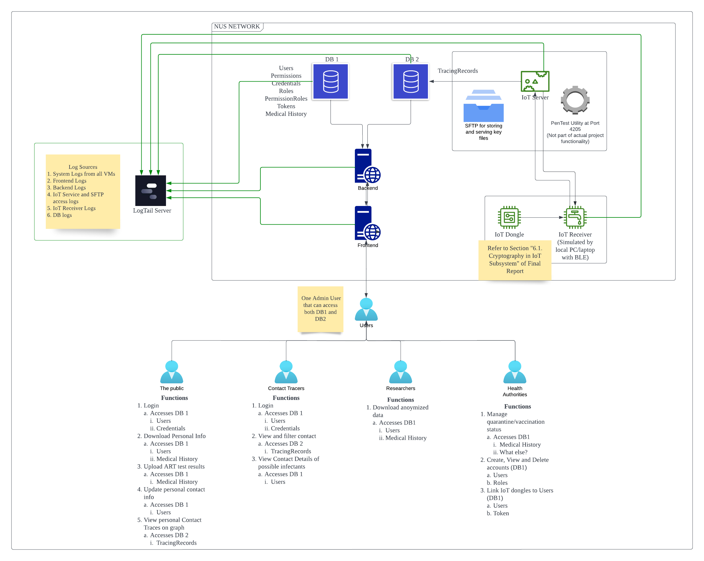

# IFS4205-AY2223-S1-G2-Track2Gather

## Project Introduction

Public Hosting : http://ifs4205-gp02-1.comp.nus.edu.sg

Public Github Repo: https://github.com/IFS4205-Group-2/IFS4205-AY2223-S1-G2-Track2Gather

Our team will develop a contact tracing application, Track-2-gather, using an IoT dongle to trace the user’s location when it comes near an IoT receiver stationed at a location.

The application will feature a user view where a notification is sent when in close contact with a possible carrier of the KIL-22 virus. Users can also log in to view if they are a close contact of a KIL-22 patient.  Users will also be able to log in to upload their test kit results.

A different view will also be available for Health authorities and Contact Tracers to view the traces of the contacts.

The application will also host a publicly anonymized and curated list of data related to the KIL-22 patients. This can be publicly accessed by researchers for their research purposes.

The application will be built based on DevSecOps and CI/CD frameworks - ensuring a security-by-design implementation of the application and its data. The security concerns addressed are primarily related to the security of the database, the provision of anonymised data for research purposes and the data transfer from IoT dongle to the servers along with its systems.

## Architecture & Tools

### Architecture

The architecture consist of 4 main subsystems
1. Frontend
2. Backend
3. Databases
4. IoT

You may find out more about the respective subsystems by checking the `README.md` in the respective directories.

### Tools

#### Web

1.
